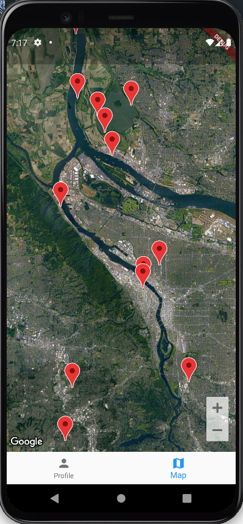
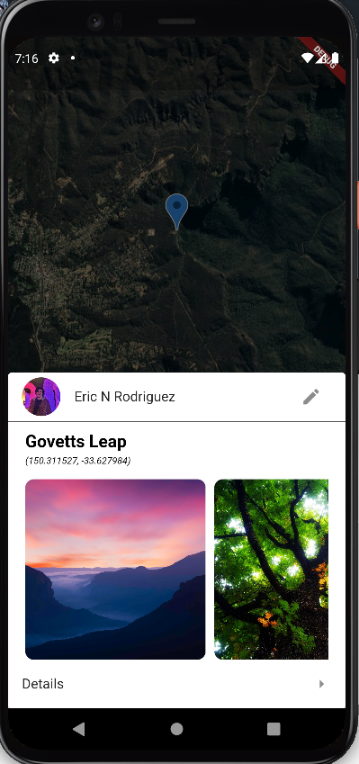
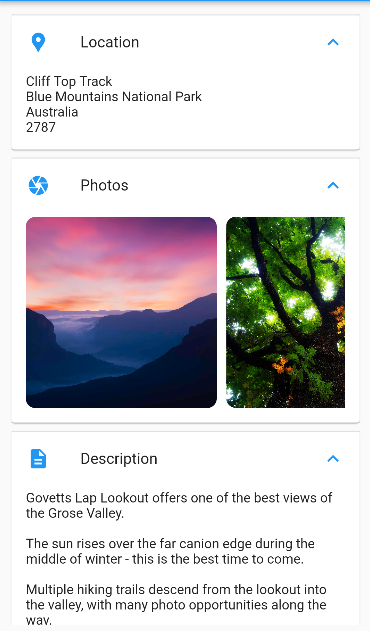
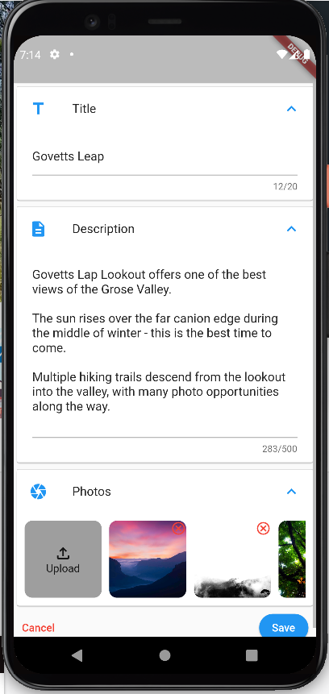

# Overview 

Dove is a mobile application that provides information sharing services to landscape photographers, allowing unknown locations to be shared and discovered. 

 

  

    
  

  

     
  

  

    
  

    

    
  

 

# Running 

#### Client 

- install `Flutter 2.8.0`
- install `Dart 2.15.1`
- launch a virtual device that has access to the google playstore (this is required for the maps api)
- run `flutter run` in the `client` directory to stand the app up

#### Backend

- `golang 1.13` is required at a minimum, in addition to `postgresql 11`. 
- stand the server up by runnung `go run main.go ../shared/config.yaml` from the `backend` directory
- an example configuration file has been provided in `config.yaml` in the `shared` directory

###### Database
- to run the backend, you'll need to create a postgresql database, then initialize it by running `init_db.sql` (located in the `backend/postgres` directory. Once done, edit the config file and the server should stand up.

